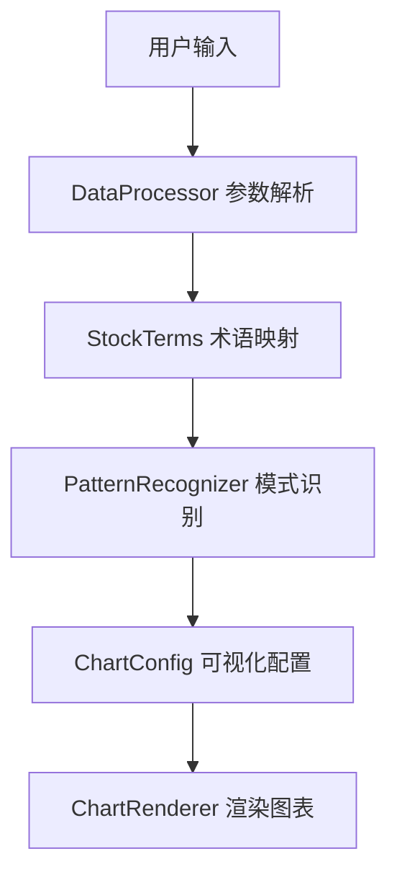

# Design Document

## Overview

量上涨模式识别功能是K线图工具的一个重要扩展，旨在自动识别并标注连续交易日内成交量持续上涨的模式。该功能将帮助投资者更好地分析市场趋势和交易信号，特别是在量价关系分析方面提供更直观的可视化支持。

本设计文档详细描述了量上涨模式识别功能的架构设计、组件接口、数据模型、算法实现和错误处理策略。

## Architecture

量上涨模式识别功能将作为现有K线图工具的一个模块进行集成，主要包括以下几个部分：

1. **模式识别器 (PatternRecognizer)** - 扩展现有的PatternRecognizer类，添加量上涨模式识别功能
2. **数据处理器 (DataProcessor)** - 增强现有的DataProcessor类，支持量上涨模式的参数解析
3. **图表配置生成器 (ChartConfig)** - 扩展现有的chartConfig.js，支持量上涨模式的可视化
4. **用户界面交互 (KLineApp)** - 更新主应用程序，支持量上涨模式的用户输入和反馈
5. **金融术语映射器 (StockTerms)** - 实现金融术语映射功能，支持专业术语的解析和转换

### 系统架构图



## Components and Interfaces

### 1. 模式识别器 (PatternRecognizer)

扩展现有的PatternRecognizer类，添加量上涨模式识别功能：

```javascript
class PatternRecognizer {
    // 现有方法...
    
    /**
     * 识别量上涨模式
     * @param {Array} volumes - 成交量数据数组
     * @param {Object} params - 识别参数
     * @param {number} params.days - 连续上涨天数
     * @param {number} params.minGrowthRate - 最小增长率
     * @param {boolean} params.strict - 是否严格要求每日增长
     * @returns {Array} - 返回识别到的模式位置数组，每个元素包含起始索引和结束索引
     */
    static recognizeVolumeIncreasePattern(volumes, params) {
        // 实现量上涨模式识别算法
    }
    
    /**
     * 分析量价关系
     * @param {Array} volumes - 成交量数据数组
     * @param {Array} klineData - K线数据数组
     * @param {Array} patterns - 识别到的模式位置数组
     * @returns {Array} - 返回量价关系分析结果
     */
    static analyzeVolumePriceRelation(volumes, klineData, patterns) {
        // 实现量价关系分析算法
    }
}
```

### 2. 数据处理器 (DataProcessor)

增强现有的DataProcessor类，支持量上涨模式的参数解析：

```javascript
class DataProcessor {
    // 现有方法...
    
    /**
     * 解析量上涨模式参数
     * @param {string} input - 用户输入
     * @returns {Object} - 返回解析后的参数对象
     */
    parseVolumePatternParams(input) {
        // 实现参数解析逻辑
    }
    
    /**
     * 处理用户输入
     * @param {string} input - 用户输入
     * @returns {Object} - 返回处理结果
     */
    processUserInput(input) {
        // 增强现有方法，支持量上涨模式
        const analysis = this.analyzeInput(input);
        
        // 解析金融术语
        const terms = StockTerms.extractTerms(input);
        analysis.financialTerms = terms;
        
        // 解析量上涨模式参数
        analysis.volumePatterns = this.parseVolumePatternParams(input);
        
        return this.generateChartData(analysis);
    }
    
    /**
     * 解析金融术语并转换为技术参数
     * @param {Array} terms - 识别到的金融术语数组
     * @returns {Object} - 返回转换后的技术参数
     */
    convertTermsToTechnicalParams(terms) {
        const params = {};
        
        terms.forEach(term => {
            switch(term.type) {
                case 'indicator':
                    // 处理指标类术语
                    params[term.indicator] = true;
                    break;
                case 'pattern':
                    // 处理形态类术语
                    params.patterns = params.patterns || [];
                    params.patterns.push(term.pattern);
                    break;
                case 'volumePrice':
                    // 处理量价关系术语
                    params.volumePriceRelation = term.term;
                    break;
            }
        });
        
        return params;
    }
}
```

### 3. 图表配置生成器 (ChartConfig)

扩展现有的chartConfig.js，支持量上涨模式的可视化：

```javascript
function getChartConfig(data) {
    // 现有配置生成逻辑...
    
    // 添加量上涨模式标注
    if (data.volumePatterns && data.volumePatterns.length > 0) {
        // 为每个识别到的模式添加标注
        data.volumePatterns.forEach(pattern => {
            // 添加成交量柱特殊颜色
            // 添加K线区域标记
            // 添加量价关系标注
        });
    }
    
    return config;
}
```

### 4. 金融术语映射器 (StockTerms)

实现金融术语映射功能，支持专业术语的解析和转换：

```javascript
class StockTerms {
    /**
     * 获取金融术语映射表
     * @returns {Object} - 返回金融术语映射表
     */
    static getTermsMapping() {
        return {
            // 技术指标术语
            "金叉": { type: "indicator", indicator: "MACD", description: "MACD指标从负值向上穿越零轴" },
            "死叉": { type: "indicator", indicator: "MACD", description: "MACD指标从正值向下穿越零轴" },
            "头肩顶": { type: "pattern", pattern: "headAndShoulders", description: "头肩顶形态" },
            "双底": { type: "pattern", pattern: "doubleBottom", description: "双底形态" },
            
            // 量价关系术语
            "量增价升": { type: "volumePrice", description: "成交量增加且价格上涨" },
            "量增价跌": { type: "volumePrice", description: "成交量增加但价格下跌" },
            "量增价平": { type: "volumePrice", description: "成交量增加但价格横盘" },
            
            // 其他术语...
        };
    }
    
    /**
     * 解析金融术语
     * @param {string} term - 金融术语
     * @returns {Object|null} - 返回解析结果，如果术语不存在则返回null
     */
    static parseTerm(term) {
        const mapping = this.getTermsMapping();
        return mapping[term] || null;
    }
    
    /**
     * 检查输入中是否包含已知的金融术语
     * @param {string} input - 用户输入
     * @returns {Array} - 返回识别到的术语数组
     */
    static extractTerms(input) {
        const mapping = this.getTermsMapping();
        const terms = [];
        
        Object.keys(mapping).forEach(term => {
            if (input.includes(term)) {
                terms.push({
                    term: term,
                    ...mapping[term]
                });
            }
        });
        
        return terms;
    }
    
    /**
     * 更新金融术语映射表
     * @param {string} term - 术语名称
     * @param {Object} definition - 术语定义
     * @returns {boolean} - 返回更新是否成功
     */
    static updateTermMapping(term, definition) {
        // 实现更新逻辑
        // 这里可能需要持久化存储
        return true;
    }
}
```

## Data Models

### VolumePattern

```javascript
{
    startIndex: number,       // 模式起始位置索引
    endIndex: number,         // 模式结束位置索引
    days: number,             // 连续上涨天数
    growthRate: number,       // 总体增长率
    dailyGrowthRates: number[], // 每日增长率数组
    volumePriceRelation: {    // 量价关系分析
        priceChange: number,  // 价格变化率
        relation: string      // 量价关系类型（如"量增价升"）
    }
}
```

### VolumePatternParams

```javascript
{
    days: number,           // 连续上涨天数
    minGrowthRate: number,  // 最小增长率
    strict: boolean         // 是否严格要求每日增长
}
```

## Algorithm Design

### 量上涨模式识别算法

1. **输入**: 成交量数据数组，识别参数
2. **输出**: 识别到的模式位置数组

```
function recognizeVolumeIncreasePattern(volumes, params):
    patterns = []
    
    for i = 0 to volumes.length - params.days:
        isPattern = true
        growthRates = []
        
        // 检查连续上涨
        for j = i to i + params.days - 1:
            if j > i:
                growthRate = (volumes[j] - volumes[j-1]) / volumes[j-1]
                growthRates.push(growthRate)
                
                if params.strict and growthRate <= 0:
                    isPattern = false
                    break
        
        // 计算总体增长率
        totalGrowthRate = (volumes[i + params.days - 1] - volumes[i]) / volumes[i]
        
        // 检查是否满足最小增长率要求
        if isPattern and totalGrowthRate >= params.minGrowthRate:
            patterns.push({
                startIndex: i,
                endIndex: i + params.days - 1,
                days: params.days,
                growthRate: totalGrowthRate,
                dailyGrowthRates: growthRates
            })
    
    return patterns
```

### 量价关系分析算法

1. **输入**: 成交量数据数组，K线数据数组，识别到的模式位置数组
2. **输出**: 带有量价关系分析的模式数组

```
function analyzeVolumePriceRelation(volumes, klineData, patterns):
    for each pattern in patterns:
        startIndex = pattern.startIndex
        endIndex = pattern.endIndex
        
        // 计算价格变化率（收盘价）
        startPrice = klineData[startIndex][1]
        endPrice = klineData[endIndex][1]
        priceChange = (endPrice - startPrice) / startPrice
        
        // 确定量价关系类型
        if priceChange > 0.03:
            relation = "量增价升"
        else if priceChange < -0.03:
            relation = "量增价跌"
        else:
            relation = "量增价平"
        
        // 添加量价关系分析结果
        pattern.volumePriceRelation = {
            priceChange: priceChange,
            relation: relation
        }
    
    return patterns
```

## Error Handling

### 1. 参数解析错误

- **问题**: 用户输入的量上涨模式参数无效或不完整
- **解决方案**: 使用默认参数，并提供友好的提示信息
- **处理**: 在DataProcessor.parseVolumePatternParams方法中添加参数验证和默认值处理

### 2. 数据不足错误

- **问题**: 数据点数量不足以识别指定天数的量上涨模式
- **解决方案**: 调整识别参数或提供友好的提示信息
- **处理**: 在PatternRecognizer.recognizeVolumeIncreasePattern方法中添加数据验证

### 3. 可视化错误

- **问题**: 量上涨模式标注渲染失败
- **解决方案**: 降级处理，仅显示基本图表
- **处理**: 在chartConfig.js中添加错误捕获和降级处理

## Testing Strategy

### 1. 单元测试

- **模式识别算法测试**: 验证PatternRecognizer.recognizeVolumeIncreasePattern方法的正确性
- **参数解析测试**: 验证DataProcessor.parseVolumePatternParams方法的正确性
- **量价关系分析测试**: 验证PatternRecognizer.analyzeVolumePriceRelation方法的正确性
- **金融术语映射测试**: 验证StockTerms.extractTerms和StockTerms.parseTerm方法的正确性
- **术语转换测试**: 验证DataProcessor.convertTermsToTechnicalParams方法的正确性

### 2. 集成测试

- **端到端流程测试**: 验证从用户输入到图表渲染的完整流程
- **边界条件测试**: 验证各种极端情况下的系统行为
- **术语识别流程测试**: 验证从用户输入包含金融术语到正确解析和应用的完整流程

## User Interface Design

### 1. 用户输入示例

- "19天量上涨"
- "连续5天成交量上涨10%"
- "平均7天量能增长"
- "上涨趋势，30天，量价齐升"

### 2. 图表标注设计

- **成交量柱标注**: 使用渐变色（如从浅绿到深绿）标注连续上涨的成交量柱
- **K线区域标记**: 在K线图顶部添加标记，指示量上涨模式的位置
- **量价关系标注**: 在标记旁添加量价关系标签（如"量增价升"）
- **悬停提示**: 当用户将鼠标悬停在标记上时，显示详细信息

## Performance Considerations

1. **算法优化**: 确保模式识别算法的时间复杂度不超过O(n)，其中n是数据点数量
2. **渲染优化**: 使用ECharts的增量渲染功能，避免重新渲染整个图表
3. **内存优化**: 避免不必要的数据复制和临时对象创建